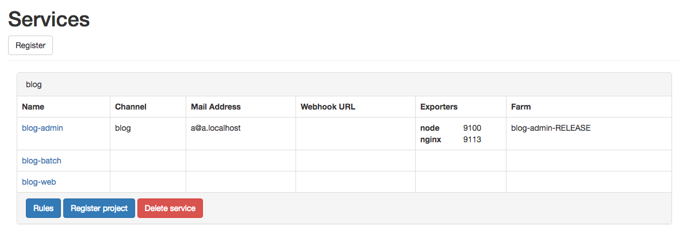
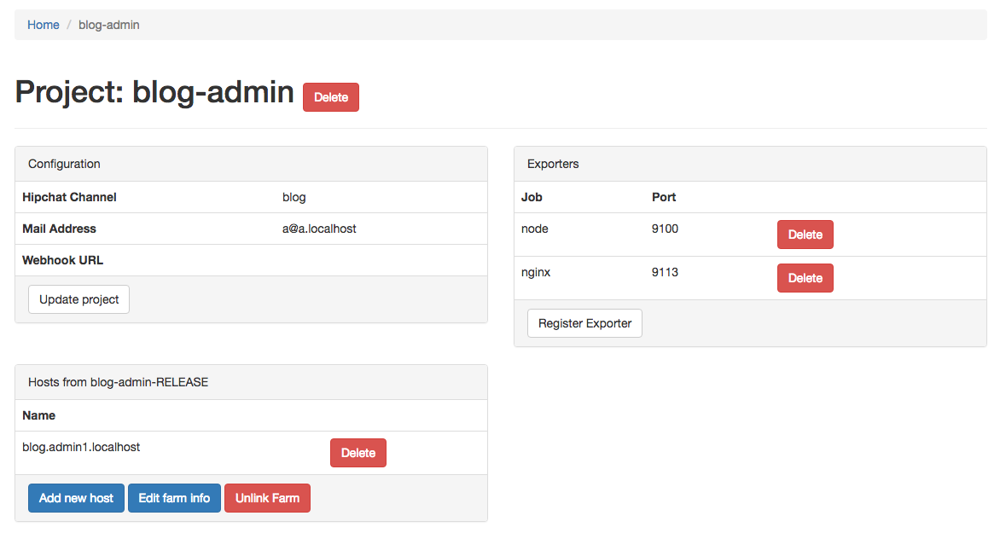
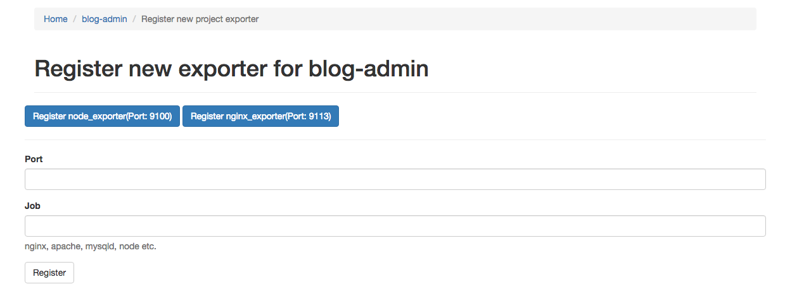
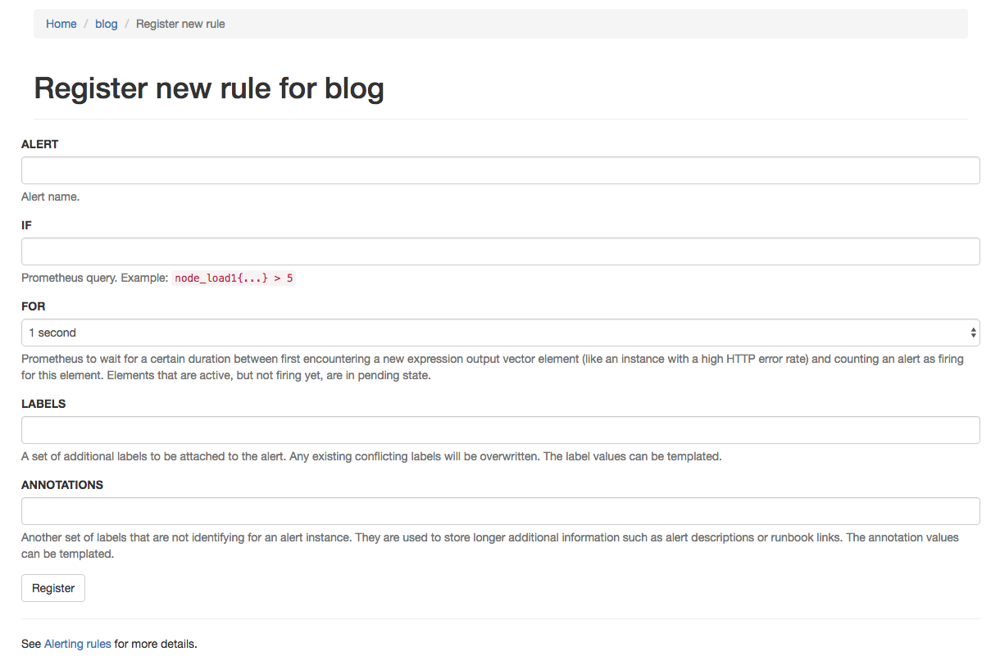

[](https://travis-ci.org/line/promgen)

# What is Promgen?

Promgen is a configuration file generator for [Prometheus](http://prometheus.io). Promgen is a web application written in Ruby and can help you do the following jobs.

* Create and manage Prometheus configuration files
* Configure alert rules and notification options

See the [Promgen introduction slides](http://www.slideshare.net/tokuhirom/promgen-prometheus-managemnet-tool-simpleclientjava-hacks-prometheus-casual) for more details.

## Promgen screenshots

> #### Service


> #### Project


> #### Exporter


> #### Rule


## Getting started

Below are the steps to get started with Promgen. Note that you should **run Promgen and Prometheus on the same machine.**

### 1. Create a Promgen configuration .yml file

First, create a Promgen configuration file by referring to config.sample.yml.

```
---
prometheus:
  url: http://prometheus.localhost/
db:
  dsn: sqlite://./db
  logging: false
config_writer:
  path: /tmp/prom.json
rule_writer:
  rule_path: /tmp/prom.rule
  promtool_path: /path/to/promtool
alert_senders:
  - module: Ikachan
    url: http://ikachan.localhost/
  - module: MailNotify
    smtp_server: smtp.localhost
  - module: Webhook
  - module: Alerta
    alerta_url: http://alerta.localhost
password: abcdefg123456
```
* `prometheus`
  * You must specify a URL for Promgen. For example:

    http://localhost:9090/

* `db`
  * If you are going to use Promgen in a production environment, use MySQL instead of SQLite.
* `promtool_path`
  * Specify a promtool_path. For example:

    /usr/local/prometheus/prometheus-1.0.0.linux-amd64/promtool

* `alert_senders`
  * Specify "alert_senders" modules if you want to be notified of the alerts. The options are described in more detail later in this document.

With this example configuration, Promgen generates prom.rule and prom.json as follows.

> #### prom.rule

```
ALERT LoadAverageHign
IF node_load1{service="blog"} > 5
FOR 1m
ANNOTATIONS {summary = "load average is high!"}
```

> #### prom.json

```
[
  {
    "targets":[
      "blog.admin1.localhost:9100"
    ],
    "labels":{
      "service":"blog",
      "project":"blog-admin",
      "farm":"blog-admin-RELEASE",
      "job":"node"
    }
  },
  {
    "targets":[
      "blog.admin1.localhost:9113"
    ],
    "labels":{
      "service":"blog",
      "project":"blog-admin",
      "farm":"blog-admin-RELEASE",
      "job":"nginx"
    }
  }
]
```

### 2. Configure the Prometheus .yml file

This is an example configuration for Prometheus.

```
rule_files:
- "/tmp/prom.rule"

scrape_configs:
  - job_name: 'dummy'
    file_sd_configs:
      - files:
        - "/tmp/prom.json"
```

When you add a host on the browser, Promgen automatically generates a /tmp/prom.json file. The information is then updated in a format as shown below.

```
[
  {
    "targets":[
      "blog.admin1.localhost:9100"
    ],
    "labels":{
      "service":"blog",
      "project":"blog-admin",
      "farm":"blog-admin-RELEASE",
      "job":"node"
    }
  },
  {
    "targets":[
      "blog.admin1.localhost:9113"
    ],
    "labels":{
      "service":"blog",
      "project":"blog-admin",
      "farm":"blog-admin-RELEASE",
      "job":"nginx"
    }
  }
]
```

### 3. Set up the database

You can migrate databases by running the following command:

    DATABASE_URL=sqlite://db rake db:migrate

### 4. Start Promgen

    bundle install
    PROMGEN_CONFIG=/path/to/config.yml bundle exec rackup

Now, the Promgen app is up and running. You can access the Promgen screen through http://localhost:9292/ and start registering services, projects, and hosts.

### 5. Configure alert notifications

> #### Alert rules

Promgen supports Webhook with which you can configure and use the alert and notification features of Prometheus. In Prometheus Alertmanager, specify the Promgen URL using `webhook_configs` as follows.

```
receivers:
- name: "promgen-webhook"
  webhook_configs:
  - url: 'http://promgen@[password]:localhost:9292/alert'
```

You can create and manage the alert rules in Promgen. Rules you create are added in /tmp/prom.rule and applied in Prometheus.

The promtool_path you specified earlier is used to validate those rules.

```
ALERT LoadAverageHign
IF node_load1{service="blog"} > 5
FOR 1m
ANNOTATIONS {summary = "load average is high!"}
```

> ####  Notification

Next, you can specify `alert_senders`. The Promgen app provides the following methods for notifying the alert.

---
```
alert_senders:
  - module: Ikachan
    url: http://ikachan.localhost/
  - module: MailNotify
    smtp_server: smtp.localhost
  - module: Webhook
  - module: Alerta
    alerta_url: http://alerta.localhost
```

* [Ikasan](https://github.com/studio3104/ikasan)

LINE uses the Ikasan tool to send HipChat messages over HTTP. This tool is useful because you don't need to manage HipChat tokens.

Specify the Ikachan(not Ikasan) module and the URL if you want to receive alert notifications through HipChat.

If you want to use `/privmsg` API endpoint, please set the environment variable `HIPCHAT_PRIVMSG` (`/privmsg` endpoint can fire the mentioned message like `Alert: @you`).

* Mail

Specify the MailNotify module and the SMPT server if you want to receive alert notifications through email.

* Webhook

When you specify the Webhook module, you need to specify the URL for each project.

* [Alerta](http://alerta.io/)

Specify the Alerta module and the URL set in your environment.

## The MIT License

Copyright (c) 2016 LINE Corporation

Permission is hereby granted, free of charge, to any person obtaining a copy
of this software and associated documentation files (the "Software"), to deal
in the Software without restriction, including without limitation the rights
to use, copy, modify, merge, publish, distribute, sublicense, and/or sell
copies of the Software, and to permit persons to whom the Software is
furnished to do so, subject to the following conditions:

The above copyright notice and this permission notice shall be included in
all copies or substantial portions of the Software.

THE SOFTWARE IS PROVIDED "AS IS", WITHOUT WARRANTY OF ANY KIND, EXPRESS OR
IMPLIED, INCLUDING BUT NOT LIMITED TO THE WARRANTIES OF MERCHANTABILITY,
FITNESS FOR A PARTICULAR PURPOSE AND NONINFRINGEMENT. IN NO EVENT SHALL THE
AUTHORS OR COPYRIGHT HOLDERS BE LIABLE FOR ANY CLAIM, DAMAGES OR OTHER
LIABILITY, WHETHER IN AN ACTION OF CONTRACT, TORT OR OTHERWISE, ARISING FROM,
OUT OF OR IN CONNECTION WITH THE SOFTWARE OR THE USE OR OTHER DEALINGS IN
THE SOFTWARE.

## How to contribute to Promgen

First of all, thank you so much for taking your time to contribute! Promgen is not very different from any other open
source projects you are aware of. It will be amazing if you could help us by doing any of the following:

- File an issue in [the issue tracker](https://github.com/line/promgen/issues) to report bugs and propose new features and
  improvements.
- Ask a question using [the issue tracker](https://github.com/line/promgen/issues).
- Contribute your work by sending [a pull request](https://github.com/line/promgen/pulls).
